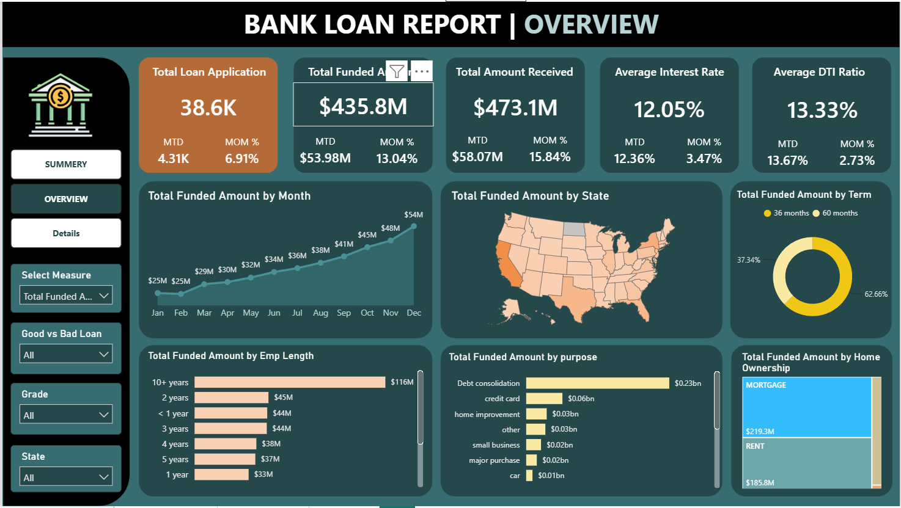
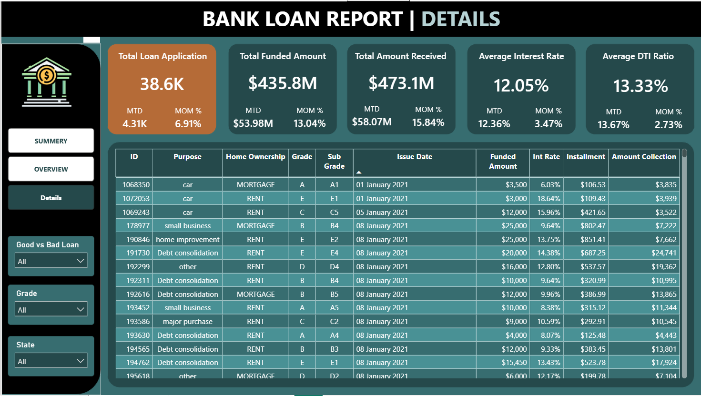

# 🏦 Bank Loan Analysis Dashboard | Power BI

## 📊 Project Overview

An interactive Power BI dashboard developed to analyze a bank's loan portfolio,
monitor lending performance, borrower behavior, loan repayments, and portfolio
quality.

The dashboard provides insights into loan applications, funded amounts,
amounts received, interest rates, DTI ratio, loan status, regional lending
activity, and Good Loan vs Bad Loan performance.

---

## 🎯 Business Objective

The objective of this project is to analyze the bank's loan portfolio and
provide stakeholders with actionable insights to:

- Monitor loan application and disbursement performance
- Track funded amounts and repayments
- Analyze Good Loans vs Bad Loans
- Evaluate lending performance across states
- Analyze loan purpose, loan term and employment length
- Monitor MTD and MoM performance
- Provide detailed loan-level information
- Support data-driven lending decisions

---

## 📌 Key KPIs

| KPI | Value |
|---|---:|
| Total Loan Applications | 38.6K |
| Total Funded Amount | $435.8M |
| Total Amount Received | $473.1M |
| Average Interest Rate | 12.05% |
| Average DTI Ratio | 13.33% |

### Good Loan Performance

- Good Loan Applications: **33.2K**
- Good Loan Application Percentage: **86.18%**
- Good Loan Funded Amount: **$370.2M**
- Good Loan Amount Received: **$435.8M**

### Bad Loan Performance

- Bad Loan Applications: **5.3K**
- Bad Loan Application Percentage: **13.82%**
- Bad Loan Funded Amount: **$65.5M**
- Bad Loan Amount Received: **$37.3M**

---

## 📈 Dashboard Pages

### 1. Summary Dashboard

Provides an executive-level overview of the loan portfolio including:

- Total Loan Applications
- Total Funded Amount
- Total Amount Received
- Average Interest Rate
- Average DTI
- Good Loan vs Bad Loan analysis
- Loan Status Grid

---

### 2. Overview Dashboard

Provides deeper analysis of lending trends and borrower characteristics.

Key visualizations include:

- Total Funded Amount by Month
- Total Funded Amount by State
- Total Funded Amount by Loan Term
- Total Funded Amount by Employment Length
- Total Funded Amount by Loan Purpose
- Total Funded Amount by Home Ownership

---

### 3. Details Dashboard

Provides loan-level details for operational analysis and audit purposes.

The dashboard includes:

- Loan ID
- Loan Purpose
- Home Ownership
- Grade
- Sub Grade
- Issue Date
- Funded Amount
- Interest Rate
- Installment
- Amount Collection

---

## 🛠️ Tools & Technologies

- **Power BI**
- **DAX**
- **Power Query**
- **Microsoft Excel / CSV**
- **Data Visualization**
- **Data Cleaning & Transformation**
- **Business Intelligence**

---

## 📊 Key Analysis Performed

### Loan Performance
Analyzed loan applications, funded amounts and borrower repayments.

### Portfolio Quality
Compared Good Loans and Bad Loans to understand overall portfolio health.

### Time Analysis
Analyzed monthly trends and MTD/MoM performance.

### Regional Analysis
Compared lending activity across different states.

### Borrower Analysis
Analyzed loans based on:

- Employment Length
- Home Ownership
- Loan Purpose
- Loan Term
- Loan Grade

### Loan Status Analysis
Compared:

- Fully Paid
- Current
- Charged Off

---

## 💡 Key Insights

- The majority of loan applications are classified as **Good Loans**.
- Good Loans account for approximately **86.18%** of applications.
- Bad Loans account for approximately **13.82%** of applications.
- Total funded amount is approximately **$435.8M**.
- Total amount received is approximately **$473.1M**.
- The average interest rate is **12.05%**.
- The average DTI ratio is **13.33%**.
- Debt consolidation represents the largest loan purpose by funded amount.

---

## 📂 Project Files

| File | Description |
|---|---|
| `Bank Loan Dashboard.pbix` | Power BI dashboard |
| `financial_loan.csv` | Source dataset |
| `Bank Loan Problem Statement.pptx` | Project requirements |
| `Dashboard/Summary.png` | Summary dashboard |
| `Dashboard/Overview.png` | Overview dashboard |
| `Dashboard/Details.png` | Details dashboard |

---

## 👨‍💻 Author

**Nikhil Shinde**

Data Analyst | Power BI | SQL | Python | Excel

---

⭐ If you found this project useful, consider giving the repository a star!
